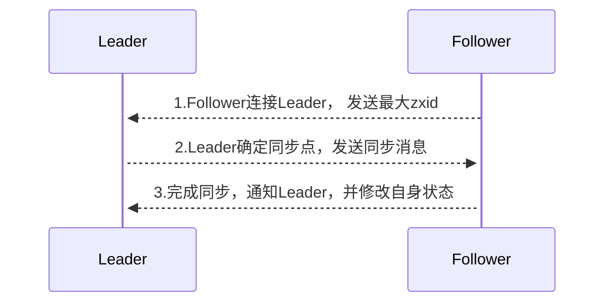

选完Leader以后，zk就进入状态同步过程。   

1. Leader等待server连接；   
2. Follower连接leader，将最大的zxid发送给leader；   
3. Leader根据follower的zxid确定同步点；   
4. 完成同步后通知follower 已经成为uptodate状态；   
5. Follower收到uptodate消息后，又可以重新接受client的请求进行服务了。

    

